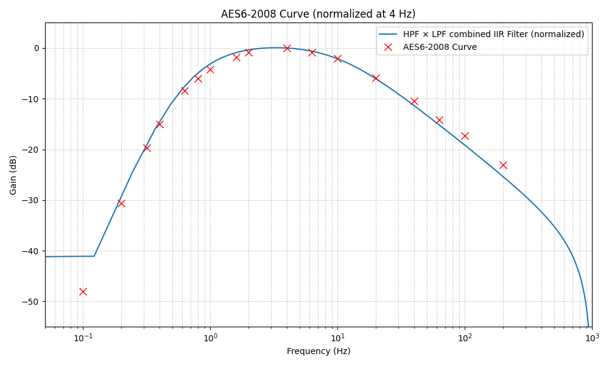

# AES6 Wow and Flutter Analysis Tool

**Python implementation for calculating and analyzing Wow & Flutter (W&F) in audio recordings according to the AES6-2008 standard** (compatible with IEC/DIN variants). This tool follows the preferred *Two Sigma* method, as described in the document:

📄 [Wow and Flutter Measurement using Multi-Instrument](https://www.virtins.com/doc/Wow-and-Flutter-Measurement-using-Multi-Instrument.pdf)

This script was created for educational purposes, in the absence of publicly available code implementing precise W&F measurements as defined by international standards.

---

## 🚀 Quick Start

> ⚠️ **If you're only interested in using the tool (without diving into the technical details), you can download the standalone Windows executable from the `dist/` folder. No Python environment required.**


*Comparison of `wnf_meter.py` results with Virtins Multi-Instrument using a 3150 Hz test tone recorded from a Reloop RP-4000MK2 turntable.*

---

## 📂 Files and Structure

- `wnf_meter.py`: Main script that performs Wow & Flutter analysis in **7 clear steps**, outputting both *unweighted* and *weighted* 2σ (Two Sigma) results.
- `weighting_filter.py`: Generates the IIR filter coefficients that implement the **AES6 weighting curve**, designed as a simple asymmetric bandpass filter.
- `weighting_filter_a.csv`, `weighting_filter_b.csv`: Coefficients used to apply the weighting filter in the analysis script.
- `assets/`: Contains sample reference audio files for testing, including synthetic modulated tones and a test signal captured from a Reloop RP-4000MK2 turntable.

---

## 📊 Reference Results

The following table compares the **theoretical weighted W&F values** for the synthetic test files (as defined in the Virtins guide) with the **measured values** obtained using this tool:

| Test File                                         | Modulation | Theoretical WnF | Measured WnF |
|---------------------------------------------------|------------|-----------------|--------------|
| 3150Hz.wav                                        | none       | 0.00000%        | 0.0000%      |
| 3150HzModulatedBy4HzAt0.00997Percent0.315Hz.wav   | 4 Hz       | 0.00997%        | 0.0100%      |
| 3150HzModulatedBy4HzAt0.00997Percent0.315Hz.wav   | 4 Hz       | 0.0997%         | 0.0997%      | 
| 3150HzModulatedBy4HzAt0.0997Percent3.15Hz.wav     | 4 Hz       | 0.997%          | 0.9969%      |
| 3150HzModulatedBy4HzAt9.97Percent315Hz.wav        | 4 Hz       | 9.97%           | 9.9687%      |
| 3150HzModulatedBy0.8HzAt0.0499Percent3.15Hz.wav   | 0.8 Hz     | 0.0499%         | 0.0567%      |
| 3150HzModulatedBy20HzAt0.0506Percent3.15Hz.wav    | 20 Hz      | 0.0506%         | 0.0496%      |
| 3150HzModulatedBy0.2HzAt0.003Percent3.15Hz.wav    | 0.2 Hz     | 0.0030%         | 0.0035%      |

*Note: You can download the full reference test set from the links provided in the Virtins document.*

---

## 🎛️ Weighting Filter Design

The `weighting_filter.py` script implements a straightforward analog-inspired design using bilinear-transformed high-pass and low-pass stages, resulting in an IIR bandpass filter that conforms to the tolerance envelope defined in AES6. The filter is designed to operate at a **sample rate of 2 kHz**, which is sufficient for the frequency range of interest in W&F analysis (typically <200 Hz).

Users can extend this script to design and validate more complex filters using the same framework.



---

## 🛠️ Dependencies

This project uses standard scientific Python libraries:

- `numpy`
- `scipy`
- `matplotlib`
- `tkinter` (for file selection dialog)

To install them:
```bash
pip install numpy scipy matplotlib
